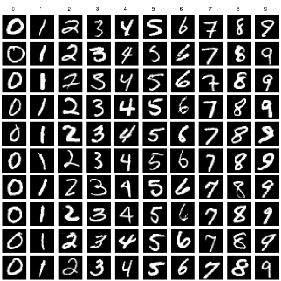

# Convolutional Neural Network (CNN) in SystemVerilog

This project implements a synthesizable Convolutional Neural Network (CNN) for video stream processing using **SystemVerilog RTL** (not high-level synthesis). The design is modular and flexible, making it suitable for hardware acceleration of image classification tasks, particularly using the MNIST dataset for testing and verification.

## Project Overview
The CNN architecture consists of convolutional and fully connected layers, which can be parameterized to customize the number and size of layers based on specific requirements. 

### Structure

The CNN model implemented in the testbench has the following layers:
- **Convolutional Layers**:
  - `conv1`: First convolutional layer with 1 input channel and 4 output channels, kernel size of 3x3, and a stride of 1.
  - `conv2`: Second convolutional layer with 4 input channels and 8 output channels, kernel size of 3x3, and a stride of 1.
- **Fully Connected Layers**:
  - `fc1`: First fully connected layer with 200 input nodes and 64 output nodes.
  - `fc2`: Second fully connected layer with 64 input nodes and 10 output nodes (matching the 10 possible classes in MNIST).

### Parameterization
The CNN’s layer sizes, number of channels, and kernel sizes are parameterizable, making it adaptable to different image dimensions, number of channels, or layer configurations. This flexibility also allows scaling to more complex datasets beyond MNIST.

## Key Components
1. **Convolutional Layers (conv1, conv2)**:
   - Each convolutional layer performs filtering operations on the input images to extract features such as edges or textures.
   - The 3x3 kernels (filters) slide across the input image, capturing spatial patterns and enabling the model to learn visual features essential for image classification.
   
2. **Fully Connected Layers (fc1, fc2)**:
   - The output from the convolutional layers is flattened and fed into fully connected layers.
   - `fc1` reduces the feature map to 64 nodes, while `fc2` outputs a 10-class score vector for classification.

3. **Data Flow and Control Logic**:
   - A key part of the design involves data management, ensuring that feature maps are processed layer-by-layer in the correct order.
   - Each layer’s results are stored in buffers and fed into the subsequent layer through controlled data paths.

4. **Weight Management**:
   - All weights are precomputed in `cnn_behind.py`, which generates reference weights and biases.
   - These weights are stored in memory and read by the SystemVerilog code during simulation to perform layer-by-layer operations.

## Simulation and Testing
The design is verified by simulating the CNN model on images from the MNIST dataset. The testbench takes in images, applies the CNN transformations, and checks the output classification against expected results.

### Simulation Steps:
1. **Load Input Image**: MNIST images are read into the testbench.
2. **Apply Convolution Layers**: The input passes through the two convolutional layers, where feature maps are generated by applying learned filters.
3. **Apply Fully Connected Layers**: The output from the convolutional layers is flattened and fed through the fully connected layers.
4. **Generate Output**: The final output is a probability score for each digit (0-9).

### Simulation Results

Simulation waveforms and output scores are analyzed to verify correctness. Example results include output class scores, layer activations, and weight applications, providing insights into CNN operations on a hardware level.

## Project Structure
- `src/`: RTL code for CNN layers, control logic, and memory interfaces.
- `sim/`: Testbench files and setup for simulation.
- `Docs/`: Documentation and result images (e.g., `design.png` and `tb.png`).
- `cnn_behind.py`: Python script that generates weights and biases for the CNN model based on a software implementation.

This hardware-based CNN design is ideal for applications requiring low-latency image classification, such as edge devices and real-time video processing, where high-level synthesis (HLS) may not offer the desired level of control or performance.
